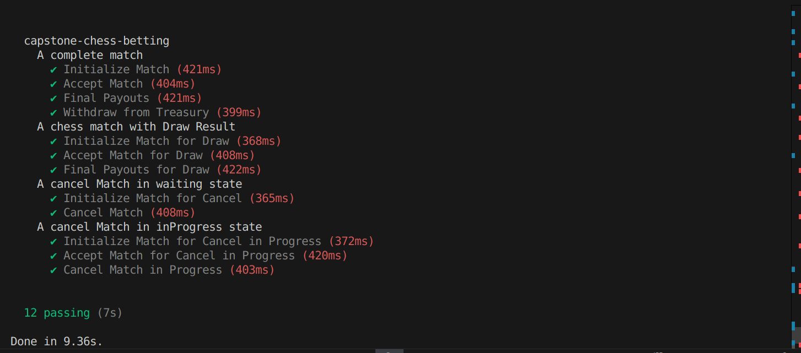
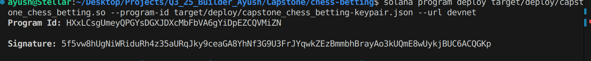

# Chess Betting Application

## All tests have been passed successfully.


## Deployed on devnet

- Program Id: HXxLCsgUmeyQPGYsDGXJDXcMbFbVA6gYiDpEZCQVMiZN
- Deployment Transaction Signature: 2H4PeRZxg6F7LEdscL51fee4GeGf19odBYbtKm98yQUckDc5uuYYr2JiEe73T3JhUPywsdmDS7y25p7LPvyFtJRX



# Chess Betting Game - Capstone Project

## Overview
The **On-Chain Chess Betting Game** is a decentralized protocol built on Solana that allows players to engage in chess matches with integrated betting mechanics. Players can deposit bets, join matches, and receive payouts based on match outcomes — all managed transparently via smart contracts.

---

## Protocol Requirements
- Create a **Match PDA** to store match details.
- Create a **Vault ATA** within the match to store player bets.
- Allow a player to **deposit a bet** in the vault.
- Allow an opponent to **join the match** by placing their bet.
- Enable players to **cancel matches** and get refunds when required.
- Update match results upon completion and **store the winner**.
- Distribute payouts:
  - Winner gets calculated winnings.
  - Handle **draw payouts** fairly.
- Allow admin-controlled **treasury withdrawals**.

---

## States and Flow

### 1. Initialize a Match & Deposit Bet
- Player selects:
  - Match duration
  - Bet amount
  - Secret game code
- A **Match PDA** is created using seeds:
  ```
  ("match", seed, player_pubkey, secret_code, program_id)
  ```
- Match state starts as **Waiting**.
- A **Vault PDA** is created with seeds:
  ```
  ("vault", match_pda)
  ```
- Player_A’s bet is transferred to the vault.

---

### 2. Accept a Match
- Opponent joins by matching the bet amount.
- Match transitions into **Active** state.

---

### 3. Cancel Match & Refund
- If requested before opponent joins, the match can be canceled.
- Deposited bets are refunded to Player_A.

---

### 4. Final Payouts
- Once the game concludes:
  - The winner is recorded.
  - The vault distributes winnings to the winner.
  - If the game is a **draw**, payouts are resolved evenly.

---

### 5. Admin Functions
- **Initialize Config:** Admin sets global parameters for the protocol.
- **Withdraw from Treasury:** Admin can withdraw collected protocol fees.

---

## Architecture Diagram (Conceptual)
```
+-------------------+        +-------------------+
|   Player A        |        |    Player B       |
|  (deposit bet)    |        |  (deposit bet)    |
+---------+---------+        +---------+---------+
          |                           |
          v                           v
      +-----------------------------------+
      |          Match PDA                |
      | (Match details, states, winner)   |
      +-----------------------------------+
                     |
                     v
      +-----------------------------------+
      |          Vault PDA                |
      |  (Stores bets, handles payouts)   |
      +-----------------------------------+
                     |
                     v
      +-----------------------------------+
      |    Protocol / Treasury (Admin)    |
      +-----------------------------------+
```

---

## Key Features
- Fully **on-chain betting system** for chess.
- Transparent match lifecycle management.
- Secure **escrow mechanism** for player funds.
- Automatic payout resolution (win/draw).
- Admin-controlled treasury for protocol management.
